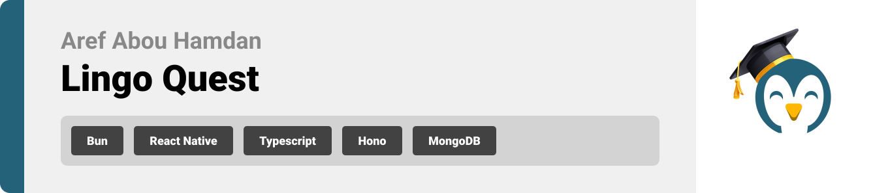

<br><br>

<!-- project philosophy -->


> The goal of **LingoQuest** is to keep the process of learning a new language fun and easy. We believe that the method of learning should feel like an adventure itself: users explore, they interact, they develop their abilities in a natural fashion.
> In short, LingoQuest is designed to inspire users to enjoy language learning by giving them both the tools and realistic practice they need to succeed.

## User Stories

### Student

- As a student, I want to select my learning level, so I can begin lessons that match my proficiency.
- As a student, I want to participate in interactive stories, so I can practice the language in real-life scenarios.
- As a student, I want to access vocabulary translations by tapping objects, so I can learn words in context.

### Tutor

- As a tutor, I want to correct learner exams and provide detailed feedback, so learners can improve their skills.
- As a tutor, I want to track the exams I’ve corrected, so I can manage my workload and ensure timely payment.
- As a tutor, I want to receive notifications when learners submit their exams, so I can prioritize corrections and provide timely feedback.

### Admin

- As an admin, I want to ensure the AI-generated prompts are accurate and culturally appropriate, so users have a high-quality experience.
- As an admin, I want to track tutor performance, so I can ensure the quality of mentorship provided.
- As an admin, I want to manage and update levels content easily, so the platform remains up-to-date and relevant for learners.

<br><br>

<!-- Tech stack -->
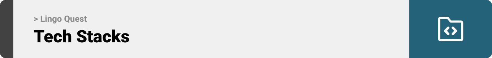

### Lingo Quest is built using the following technologies:

- This project uses the React Native framework with TypeScript for cross-platform mobile app development. React Native, combined with TypeScript, ensures a unified codebase for both iOS and Android, providing type safety and efficient development.
- For persistent storage, the app uses AsyncStorage to locally store user data, while React Query is used to manage data fetching and synchronization with the backend.
- The backend is powered by Bun and Hono, providing a fast and lightweight server framework, while MongoDB is used as the database for flexible and scalable data management. TypeScript is used throughout the backend for robust and maintainable development.

<br><br>

<!-- UI UX -->


> We designed Lingo Quest using wireframes and mockups, iterating on the design until we reached the ideal layout for easy navigation and a seamless user experience.

- Project Figma design [figma](https://www.figma.com/design/YuCnYB016k6otH4UYFzOdr/Final-Project?node-id=0-1&t=LRCSuRVlx9wYEEbz-1)

### Mockups

| Home screen                            | Levels Screen                      | Profile Screen                      |
| -------------------------------------- | ---------------------------------- | ----------------------------------- |
| 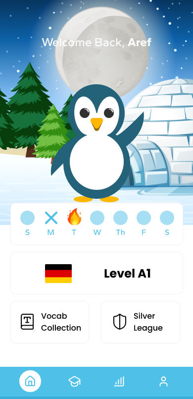 | 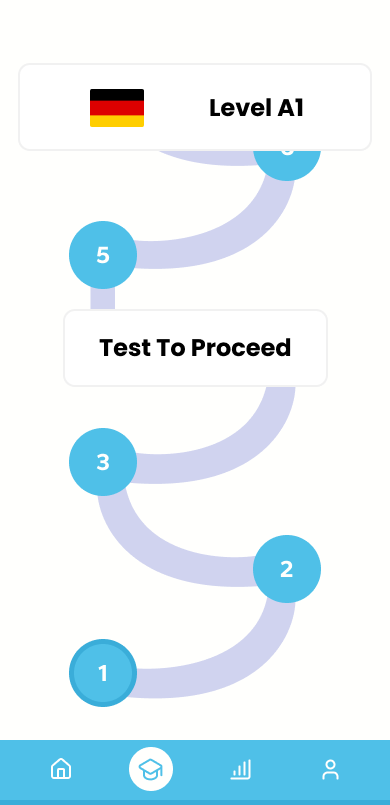 | 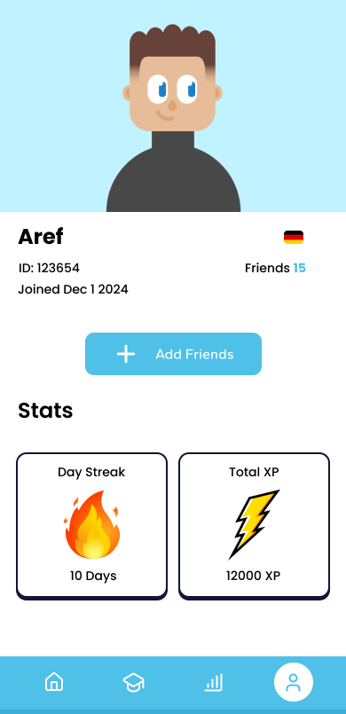 |

<br><br>

<!-- Database Design -->


### Architecting Data Excellence: Innovative Database Design Strategies:


| User Model 1/3                                 | User Model 2/3                               | User Model 3/3                               |
| ---------------------------------------------- | -------------------------------------------- | -------------------------------------------- |
|  |  |  |

| Test Model                       | Results Model                      | Level Model                                 |
| -------------------------------- | ---------------------------------- | ------------------------------------------- |
| 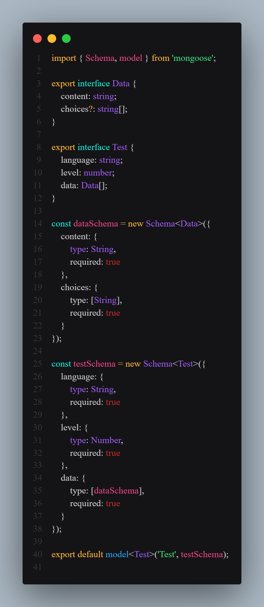 | 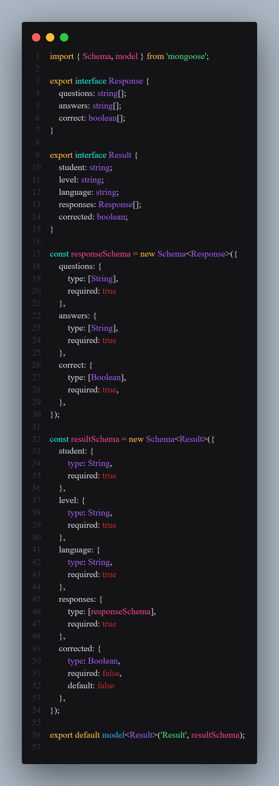 |  |

<br><br>

<!-- Implementation -->


### User Screens (Mobile)

| Create Avatar Screen                        | Student Home Screen                       | Vocab List Screen                        |
| ------------------------------------------- | ----------------------------------------- | ---------------------------------------- |
|  |  |  |

| Levels screen                        | Level 1 Start                                 | Level 1 End                                 |
| ------------------------------------ | --------------------------------------------- | ------------------------------------------- |
| 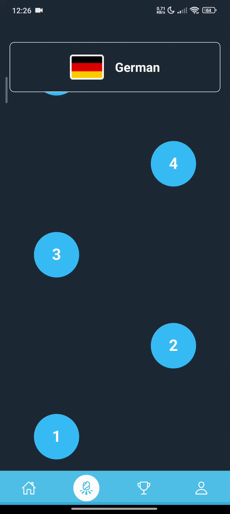 |  |  |

| Hint Modal                         | Test Screen                      | Top 50 Screen                           |
| ---------------------------------- | -------------------------------- | --------------------------------------- |
| 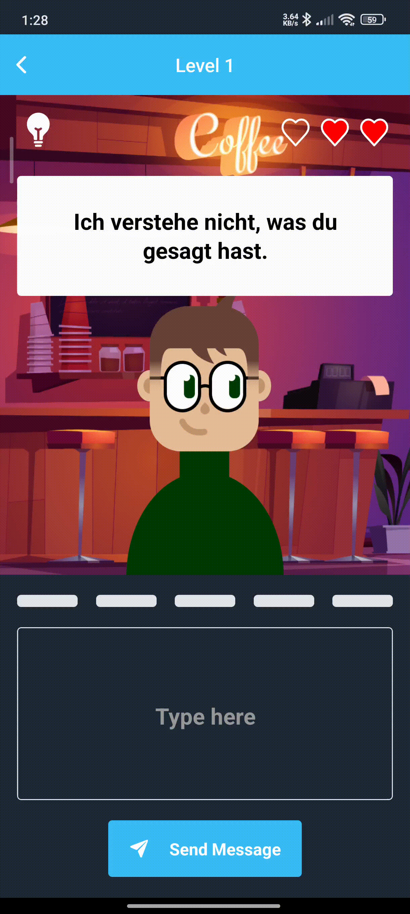 | 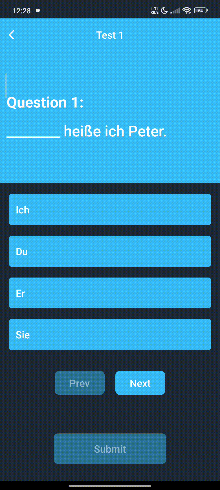 | 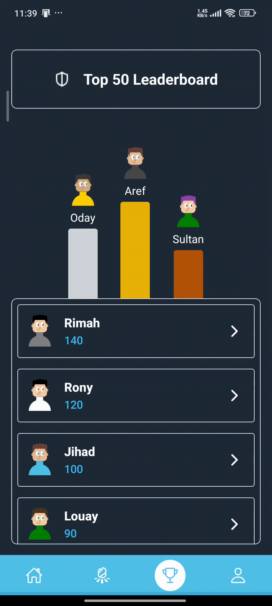 |

| Profile screen                        | Test Correction                                       | Tutor Home screen                       |
| ------------------------------------- | ----------------------------------------------------- | --------------------------------------- |
| 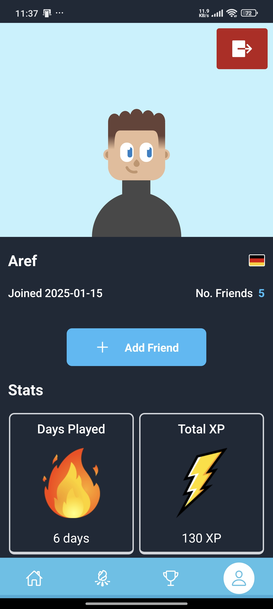 |  | 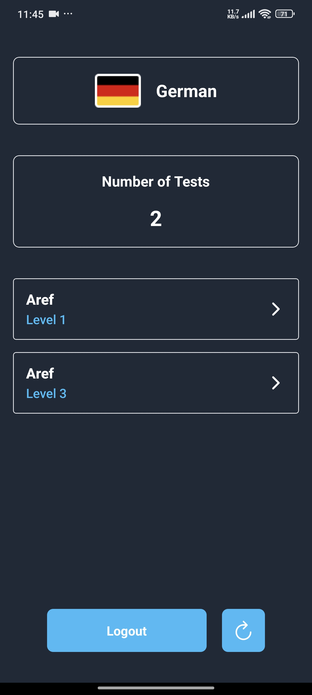 |

<br><br>

<!-- Prompt Engineering -->


### Enhancing user's learning experience with prompt engineering:

- This project utilizes advanced prompt engineering methods to enhance the interaction between learners and AI-powered language models. It is powered by Gemini 2.0 Experimental, which provides the dialogue with the user in JSON format.

- The AI is provided with the user's input, prompt and chat history so that the conversation remains relevant to the user's previous responses. The prompt is designed to simulate the scenario and match the student's level, it is given number of stages to ensure that the conversation continues until all stages of the level are completed. It ensures that the user avoids grammar mistakes, stays on topic, sends status updates (success = next stage, fail = lose 1 heart), and, lastly, provides hints and translations for the AI's responses.


<br><br>

<!-- AWS Deployment -->


### Backend deployed on an AWS server to ensure reliability and scalability:

- This project leverages AWS deployment strategies to seamlessly integrate and deploy natural language processing models. With a focus on scalability, reliability, and performance.

| Login API                          | Fetch Prompt API                            |
| ---------------------------------- | ------------------------------------------- |
| 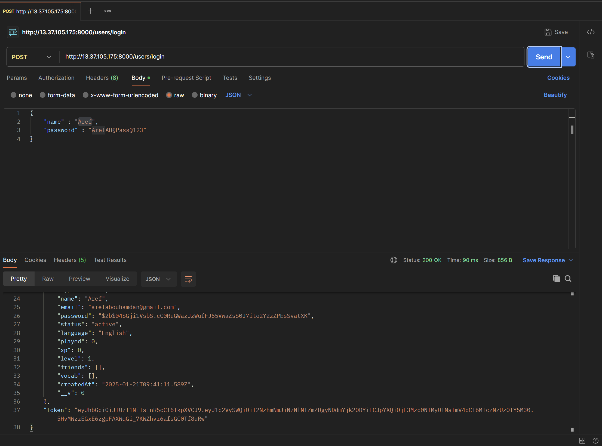|  |

| Submit Test API                           | Fetch Student Results API                   |
| ----------------------------------------- | ------------------------------------------- |
|  |  |

<br><br>

<!-- How to run -->


> To set up Lingo Quest locally, follow these steps:

### Prerequisites

This is an example of how to list things you need to use the software and how to install them.

- bun (Windows)
  ```sh
  powershell -c "irm bun.sh/install.ps1|iex"
  ```
- bun (Mac / Linux)
  ```sh
  curl -fsSL https://bun.sh/install | bash
  ```

### Installation

_Below is an example of how you can run Lingo Quest locally._

1. Get a free Gemini API Key at [Google AI Studio](https://aistudio.google.com/prompts/new_chat)

2. Clone the repo
   git clone [github](https://github.com/arefabouhamdan/Lingo-Quest.git)

3. To set up the front end
   ```sh
   cd Lingo-Quest-App
   bun install
   ```

4. Enter your IP Address in `assets/utils/baseUrl`

   ```ts
   export const BASE_URL = "http://YOUR IP ADDRESS:3000";
   ```

5. Run the App with
   ```sh
   bun start
   ```

7. To set up the backend end(in a new terminal)
   ```sh
   cd Lingo-Quest-Server
   bun install
   ```

8. Enter your API in `Lingo-Quest-Server/.env`
   ```ts
   const GEMINI_API_KEY = "ENTER YOUR API KEY";
   ```

9. Enter your MongoDB URL
   ```ts
   const MONGODB_URL = "ENTER YOUR URL";
   ```

10. Run the Server with
   ```sh
   bun dev
   ```

Now, you should be able to run Lingo Quest locally and explore its features.
